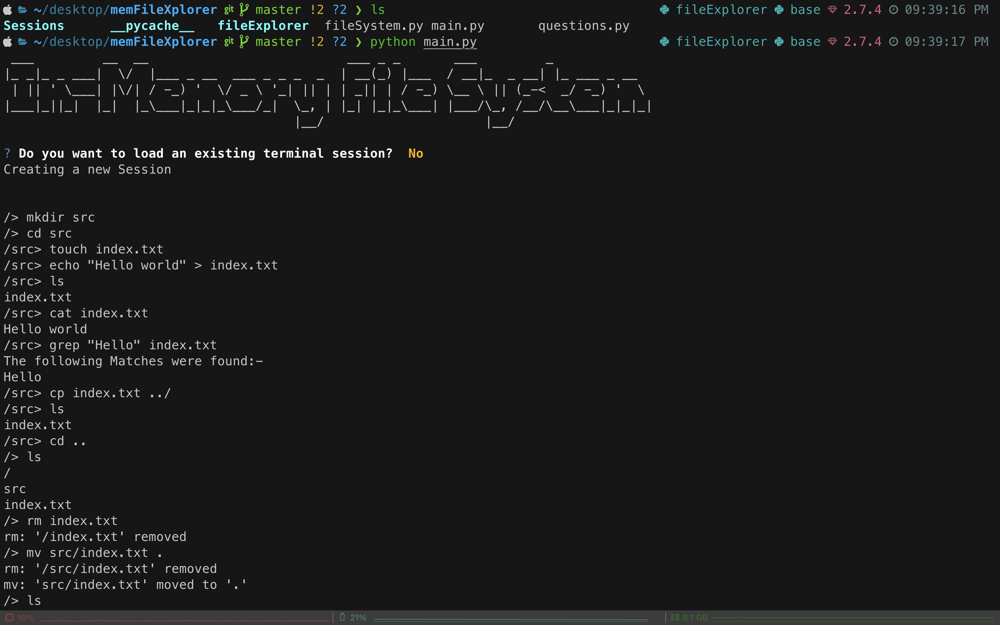
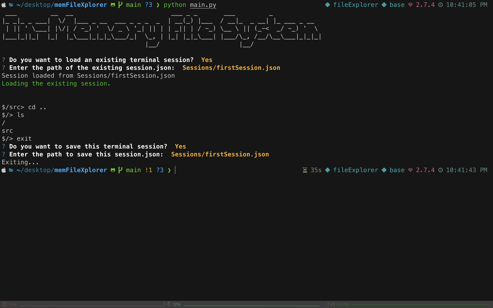

# In-Memory File System CLI




## Introduction 💡
Welcome to the In-Memory File System CLI, a command-line tool that simulates the functionalities of a basic file system. This project is implemented in Python, providing an interactive and user-friendly interface to perform operations such as creating directories, listing contents, changing directories, creating files, and more. The tool utilizes an in-memory data structure to store the file system hierarchy, allowing users to navigate and manipulate the virtual file system.

### In-Memory File System Logic and Data Structure

The `FileSystem` class represents a simplified in-memory file system implemented in Python. Here's an explanation of the logic and data structure behind it:

#### Data Structure:

The primary data structure used is a `nested dictionary`, where each directory is represented by a key in the dictionary, and the value associated with each key is another dictionary representing the contents of that directory. Files are represented as keys with an associated empty string as their value.

Example Representation:
```python
{
    "/": {
        "home": {
            "user": {
                "file1.txt": "",
                "file2.txt": "",
                "documents": {
                    "file3.txt": "",
                    "file4.txt": ""
                }
            }
        },
        "var": {
            "log": {
                "syslog": ""
            }
        }
    }
}
```

#### Logic Explanation:

1. **Class Initialization:**
   - The `__init__` method initializes the file system with a root directory ("/") and an empty content dictionary.

2. **Session Saving and Loading:**
   - The `save_session` method serializes the current state of the file system (current directory and root structure) into a JSON file.
   - The `load_session` method loads a previously saved session from a JSON file and restores the file system to that state.

3. **Path Manipulation:**
   - The `_getAbsolutePath` method converts a given path to an absolute path.
   - The `_isDirectory` method checks if a given path leads to a directory in the file system.
   - The `_isValidPath` method checks if a given path is valid in the file system.

4. **Content Manipulation:**
   - The `_echoUpdateContent` method updates or overrides the content of a file specified by the provided path.
   - The `_echoAppendContent` method appends content to a file specified by the provided path.
   - The `_echoCommandParser` method parses the parameters of the `echo` command.


This in-memory file system is implemented with basic file and directory manipulation capabilities, providing a command-line interface for users to interact with the simulated file system. The underlying nested dictionary data structure allows for easy representation and manipulation of the file system hierarchy.

## Project Setup
1. **Clone the project repository:**
    ```bash
    git clone https://github.com/Parth442002/memFileXplorer.git
    ```
2. **Navigate to the project directory:**
    ```bash
    cd memFileXplorer
    ```
3. **Setup VirtualEnv:**
   ```bash
   python -m venv venv
   source venv/bin/activate
   ```

4. **Run the CLI application:**
    ```bash
    python main.py
    ```
6. **Docker Setup**
   ```
   docker build -t memfile:1.0 .
   docker run -it memfile:1.0
   ```
7. **Follow on-screen instructions to navigate and perform file system operations.**

## Command Examples
- `mkdir directory_name`: Create a new directory.
- `ls [path]`: List contents of the current or specified directory.
- `cd path`: Change the current directory.
- `touch file_name`: Create a new file.
- `echo "content" > file_name`: Add or overwrite file content.
- `cat file_name`: Read file content.
- `rm path`: Remove file or directory.
- `grep pattern file_name`: Search for patterns in a file.
- `cp source_path destination_path`: Copy file or directory.
- `mv source_path destination_path`: Move file or directory.
- `exit`: exit the In-Memory File System
